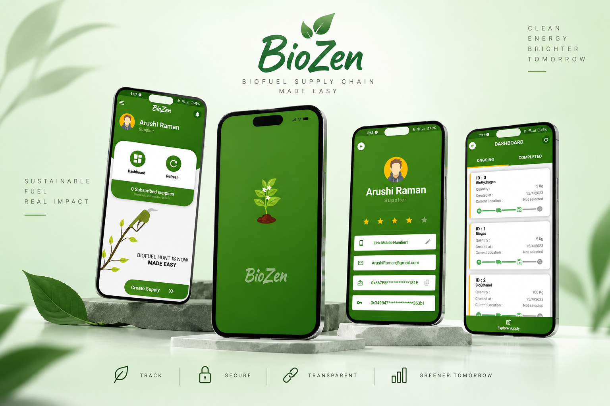

# 🌱 BioZen

**BioZen** is a blockchain-based biofuel supply chain management application developed using **Dart and Android Studio**. The application uses the **Ethereum blockchain** to record and manage transactions, providing a more transparent and secure approach to managing activities across the biofuel supply chain.

## 🚀 Features

- 🔗 **Ethereum Blockchain Integration** — Records supply-chain transactions on the blockchain.
- ⛓️ **Transaction Management** — Enables secure recording and tracking of transactions.
- 🌱 **Biofuel Supply Chain Management** — Helps manage activities throughout the biofuel supply chain.
- 📊 **Dashboard** — Provides an overview of relevant supply-chain information.
- 📱 **Android Application** — Designed for mobile access and ease of use.
- 🔐 **User Authentication** — Secure login and access to the application.

## 🛠️ Technologies Used

- **Dart**
- **Android Studio**
- **Ethereum Blockchain**
- **Solidity**
- **Smart Contracts**
- **Android SDK**

## 📱 App Showcase

## ⛓️ Blockchain

BioZen uses the **Ethereum blockchain** to support transaction management within the biofuel supply chain. Blockchain technology provides a transparent and tamper-resistant record of transactions between participants.

The application interacts with blockchain-based smart contracts to facilitate the recording and management of supply-chain transactions.

## 🎯 Objective

The primary objective of BioZen is to provide a digital platform for managing the biofuel supply chain while using blockchain technology to improve **transparency, security, and traceability**.

## ⚙️ Getting Started

### Prerequisites

- Android Studio
- Android SDK
- Dart / Flutter environment, as required by the project
- Ethereum-compatible blockchain environment
- Required smart contracts and dependencies
